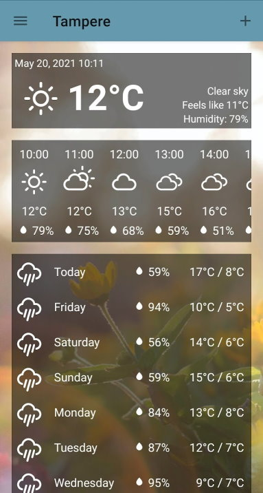
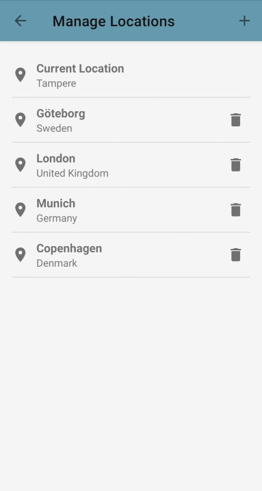
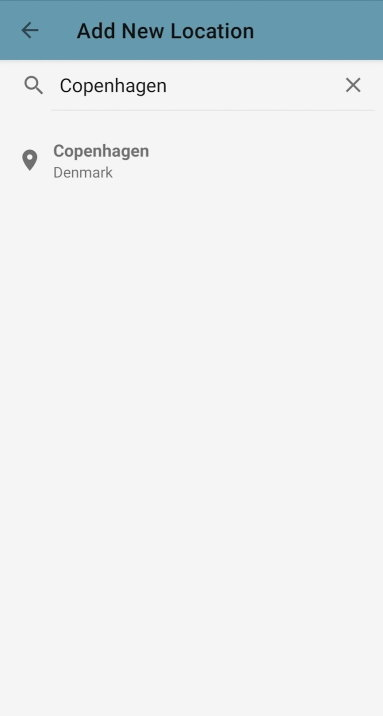

# Generic Weather App

A basic weather app for Android written in Kotlin.

[Available on Google Play.](https://play.google.com/store/apps/details?id=fi.tuni.genericweatherapp)

## Features
- Displays weather data for the selected location with [OpenWeatherMap API](https://openweathermap.org/api)
- Fetches a background image related to the weather with [Pexels API](https://www.pexels.com/api/)
- Weather can be retrieved either with GPS coordinates or by searching for a location name
- Viewed locations are saved to device for easier access
- Displays temperature in Celsius, Fahrenheit and Kelvin.

## Building
API Keys for OWM and Pexels are needed at lines 19 and 24 in Utils.kt.
The PhotoCollection enum in the same file also needs to be modified to use collections owned by the account holding the Pexels API key. Each collection should have at least one image.

Project can be built with Android Studio, or alternatively from the command line as long as Android SDK is installed:

Windows: `gradlew build`

Linux/Mac: `./gradlew build`

The resulting APK file can be found at `app/build/outputs/release/`

## Screenshots

